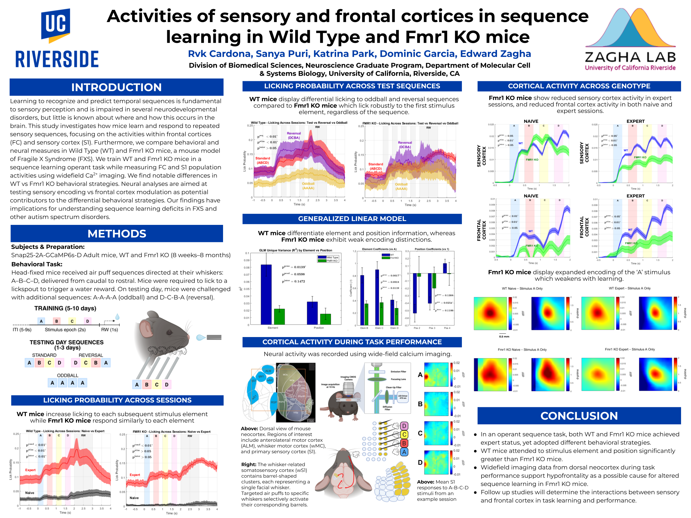

# SFN 2025 – Sequence Learning in Wild Type and FMR1 KO Mice
### Presented at the Society for Neuroscience Annual Meeting (2025) – San Diego, CA  
All figures, analyses, and code in this repository were created by **Rvk Cardona**.

Under the guidance of PhD candidate Dominic Garcia, this analysis was developed as part of an ongoing project investigating sequence learning and selective sensory filtering in mice using widefield calcium imaging.

## Poster  

---
## Overview  

This repository contains the full analysis pipeline used for my **2025 Society for Neuroscience poster**, where I examined how **wild-type (WT) and FMR1 knockout (KO) mice** learn and respond to sensory sequences, using behavioral licking analysis, generalized linear modeling, and wide-field calcium imaging.

Our central question:  
**How does Fragile X Syndrome alter the way the brain processes and learns predictable sensory sequences?**

## Methods Summary  

We trained head-fixed mice on an **air-puff sequence discrimination task** adapted from Gavornik & Bear.  
Mice received whisker air puffs in the order **A → B → C → D** and learned to lick during a reward window to obtain water. This operant structure allowed us to track **licking behavior as a measure of learning**.

After training on the **standard ABCD sequence**, we introduced:

- **Reversal (DCBA):** to test sensitivity to the order  
- **Oddball (AAAA):** to test whether mice rely on element identity  

These manipulations allowed us to determine whether mice place value on specific elements and whether they use sequence structure to guide behavior.

---

# Repository Structure  
Each folder contains its own README with detailed explanations of the scripts.  

# /behavioral_licking — Licking Behavior Across Sequences  

### What we asked  
Do wild-type and FMR1 KO mice learn the standard sequence differently?  
Do they adjust their licking when the sequence is reversed or disrupted?

### Summary of Findings  

**Standard Sequence (ABCD):**  
- WT mice show a **ramping lick probability**, anticipating the reward.  
- FMR1 KO mice **lick strongly at A** and never ramp, suggesting poor sequence learning.

**Modified Sequences:**  
- **WT mice:**  
  - In **reversal**, they lick strongly at D, showing they track sequence structure.  
  - In **oddball**, licking is low because the stimulus gives no predictive information.  
- **KO mice:**  
  - Lick strongly to the **first element** of every sequence.  
  - Show no behavioral adjustment across conditions.

These results show WT mice use **sequence information** to guide licking, while KO mice rely on a simple **first-element response**.

➡️ See the **/behavioral_licking** folder for scripts and details.

---

# /glm — Element Identity vs Position in Licking  

### What we asked  
Do mice use **element identity** or **position** to decide when to lick?  
Do WT vs KO mice rely on these cues differently?

### Summary of Findings  

We ran **generalized linear models** using:

- Element identity  
- Sequence position  
- Pre-reward licking  
- Trial number  

We compared these models across genotypes.

**WT mice:**  
- Higher **R²**, indicating stronger use of sequence information  
- Larger **beta coefficients** for **elements**  
- Strong negative **position betas** for earlier positions, indicating they track sequence progression  

**KO mice:**  
- Lower R²  
- Weak element and position encoding  
- Show no meaningful distinction between elements or positions  

**Conclusion:**  
WT mice rely on both *what* the stimulus is and *where* it occurs, whereas KO mice do not.

➡️ See the **/glm** folder for code and model comparison.

---

# /encoding — Cortical Activity During Learning  

### What we asked  
What neural mechanisms explain the behavioral differences?  
We analyzed wide-field calcium imaging signals in:

- Sensory cortex (wS1)  
- Frontal cortex (wM2)

### Summary of Findings  

Two frameworks exist in Fragile X research:

1. **Sensory hyperexcitability**  
2. **Hypofrontality**

Our data show:

**Naïve State:**  
- Sensory activity is similar between WT and KO  
- KO mice show **reduced frontal activity**, consistent with hypofrontality

**Expert State:**  
- WT mice show increased sensory and frontal activity  
- KO mice show decreased sensory activity and persistently low frontal activity  

### Spatial Activation Maps (Stimulus A, wS1)

- Naïve KO mice show **stronger and more widespread** activation than WT  
- With learning, KO patterns weaken and lose spatial structure  
- WT maps remain more constrained and consistent  

**Conclusion:**  
The results support the **hypofrontality** framework, suggesting reduced frontal engagement underlies learning deficits in Fragile X mice.

➡️ See the **/encoding** folder for imaging analysis and map alignment scripts.

## Contact  

For questions about code or methods, feel free to reach out through GitHub or email.

